## Development Fund Proposal

**Author:** Namas Labs Private Ltd, Location: Singapore
**Status:** Draft
**Created:** 2026-08-19
**Label:** defi-protocols

**[Champion](https://github.com/canton-foundation/canton-dev-fund/blob/main/sig-directory.md):** **
**Project Duration:** 1 year(6 months building, 6 months adoption)
**Label:** defi-liquidity

---

## Abstract

The Canton ecosystem is converging on a tokenized vault standard: the ERC-4626-equivalent interface proposed in [PR #99](https://github.com/canton-foundation/canton-dev-fund/pull/99), which defines how a depositor enters and exits a vault and how shares are priced. That standard is necessary and we intend to build on it directly rather than propose an alternative.

It is not, on its own, sufficient. A vault interface answers *what a depositor may ask for*. It does not answer the three questions that determine whether depositor funds are actually safe: 
1. **where the share price comes from and what stops it moving wrongly**
2. **what the party managing the capital is permitted to do with it**
3. **what happens when redemption demand exceeds what the vault can liquidate today**. 

On Canton these are not theoretical concerns, the network's most significant native yield opportunity, locking Canton Coin to hold Featured App status under CIP-0116, carries a **60-day unlock period**, which makes synchronous redemption unimplementable and off-ledger valuation unavoidable.

This proposal funds the open-source **safety and execution layer** that sits around the vault standard: a manipulation-resistant valuation contract, a bounded-authority mandate system governing what a strategy manager may do, an orderly redemption queue for positions that cannot unwind on demand, and rate-limited automated operators. All four ship MIT-licensed as reusable Daml infrastructure that any vault built to the ecosystem standard can adopt.

To prove the layer end-to-end we deliver two reference strategies against it: **pooled CC locking for Featured App status** which is the flagship, and the case that forces every component to exist and a **delta-neutral funding-rate strategy**, which Hyprearn runs today on a per-account basis off-ledger and which this grant implements in Daml as a pooled, mandate-governed strategy.

---

## Specification

### 1. Objective

Deliver a production-ready, audited, MIT-licensed set of Daml contracts that make vaults on Canton safe to operate and safe to deposit into, comprising:

1. **Valuation Contract:** the authoritative source of share price for a vault, hardened against manipulation and error.
2. **Strategy Mandate:** an on-ledger, typed enumeration of exactly what actions a strategy manager may take with vault assets, enforced by Daml authorization.
3. **Redemption Queue:** request-and-settle withdrawal handling for vaults holding positions with non-zero unwind time.
4. **Bounded Operators:** a pattern for automated keepers that act within both frequency limits and economic limits, without holding full manager authority.

Plus, to demonstrate and validate the layer:

5. **Two reference strategies:** pooled CC locking for Featured App status, and a delta-neutral funding-rate strategy and a conformance test suite any third party can run against their own strategy or vault.

This is a single objective: the safety layer for standard-conformant vaults, with the minimum set of strategies needed to prove it works under real conditions. It is explicitly **not** a proposal to fund Hyprearn's operated vault business; the operated deployment exists to demonstrate the framework and to satisfy the Fund's preference for adoption evidence over artifacts.

### 2. Implementation Mechanics

The layer sits between the tokenized vault standard, which we adopt, and the strategies that hold the assets. The four blue components are what this grant delivers and publishes under MIT; the grey Vault is the adopted standard, the green nodes are the two reference strategies, and the tan node is state that exists off-ledger.

```mermaid
flowchart TB
    DEP(["Depositor"])
    MGR(["Strategy manager"])
    KEEP(["Keeper"])
    SOLV(["Solver"])

    VAULT["<b>Vault</b><br/>share accounting, deposit and redeem<br/>CIP-0056 share tokens"]

    MAND["<b>Strategy Mandate</b><br/>permitted typed choices and argument<br/>constraints, scoped per manager, revocable"]
    BOP["<b>Bounded Operator</b><br/>frequency limits, slippage limits"]
    QUEUE["<b>Redemption Queue</b><br/>discount, maturity, deadline, per-asset caps"]
    VAL["<b>Valuation Contract</b><br/>update delay, deviation bounds<br/>auto-pause, high-water-mark fees"]

    CCLOCK["<b>Pooled CC locking</b><br/>CIP-0116 Featured App status"]
    DNEUT["<b>Delta-neutral funding rate</b><br/>hedge composition disclosed on-ledger"]

    POS[/"Off-ledger position state<br/>60-day locked CC, hedge legs across venues"/]

    DEP -->|deposit / redeem| VAULT
    VAULT -->|beyond liquid buffer| QUEUE
    QUEUE -->|matured request| SOLV
    SOLV -->|payout at agreed discount| DEP

    MGR -->|typed choice| MAND
    KEEP --> BOP
    BOP -->|narrowed authority| MAND
    VAULT -->|vault authority AND live mandate| MAND
    VAULT -.->|reads price, pause state| VAL

    MAND -->|authorised action| CCLOCK
    MAND -->|authorised action| DNEUT
    CCLOCK --> POS
    DNEUT --> POS
    POS -->|value submitted| VAL

    classDef actor fill:#ffffff,stroke:#5b6472,stroke-width:1px,color:#1f2430
    classDef adopted fill:#e8edf5,stroke:#5b6472,stroke-width:1.5px,color:#1f2430
    classDef grant fill:#dbe7ff,stroke:#2f5fd0,stroke-width:2px,color:#12224a
    classDef strat fill:#e6f2e8,stroke:#2f7d4f,stroke-width:1.5px,color:#123222
    classDef ext fill:#f5f1e4,stroke:#8a7a3f,stroke-width:1.5px,color:#3a3211

    class DEP,MGR,KEEP,SOLV actor
    class VAULT adopted
    class MAND,BOP,QUEUE,VAL grant
    class CCLOCK,DNEUT strat
    class POS ext
```

Two paths carry the safety properties. **Valuation:** position values that cannot be read from the ledger enter through a contract that bounds them, rate-limits them, and pauses the vault rather than accepting a rate outside its band. **Authority:** no vault asset moves without both the vault's own authority and a live mandate permitting that specific action, whether the actor is a human manager or a keeper operating under a further-narrowed Bounded Operator. The Redemption Queue exists because the flagship strategy holds a position with a 60-day unlock, so a depositor who needs liquidity sooner exits by pricing that urgency to a solver rather than forcing a distressed unwind.

#### 2.0 What we adopt rather than build

Share accounting, deposit/redeem entry points, and CIP-0056 share-token issuance are **taken from the ecosystem tokenized vault standard** (PR #99) once it lands. We implement against that interface and contribute conformance tests back. Where our components need behaviour the standard does not yet specify principally, how `Vault_MaxWithdraw` should answer for a vault holding a long-cooldown position, we will raise it as an amendment to that CIP rather than fork the interface.

*Dependency note:* the vault CIP and its reference implementation are scheduled inside PR #99's Milestone 2. Our Milestone 1 is specified against the interface as described in that proposal's amendment (the four core, four max, four preview, two convert and two read methods) and can be developed in parallel against a local implementation of that interface, then re-pointed at the canonical one. This is a real schedule risk and is addressed in §Rationale.

#### 2.1 Valuation Contract

The share price of a vault holding lending positions can be computed by reading the ledger. The share price of a vault holding a 60-day-locked CC position, or a hedged position whose legs sit on different venues, cannot. Valuation must therefore be submitted by a designated party, which immediately raises the question of what stops a compromised or mistaken submitter from destroying the vault.

The Valuation Contract constrains submissions structurally:

- **Minimum update delay:** a new rate cannot be written before a configured interval has elapsed since the last.
- **Deviation bounds:** a new rate must fall within a configured upper and lower band relative to the currently accepted rate. Bands are set per vault at creation and are visible to depositors.
- **Automatic pause:** a submission violating either constraint does not merely revert. It moves the vault to a paused state that halts deposits, redemptions and further rate updates until an explicitly authorised party intervenes. Failure is loud and safe rather than silent.
- **Fee accrual:** platform fee and performance fee accrue against a high-water mark inside the same contract, so a vault cannot charge performance fees on a recovery from a drawdown.

Because Daml records the full authorization chain of every submission, the identity of the submitting party and the resulting rate are auditable on-ledger by every party entitled to see the vault, a property that requires additional infrastructure on transparent public ledgers and is native here.

#### 2.2 Strategy Mandate

A vault that can hold assets must give some party the authority to deploy them. The design question is how to grant that authority narrowly enough to be safe while keeping it broad enough to be useful.

Canton's authorization model makes this substantially cleaner than it is on account-based ledgers. There is no arbitrary dispatch: a party acts by exercising a **typed choice** on a contract, with named, typed arguments visible to the authorization logic. A mandate can therefore be expressed directly as data rather than reconstructed from opaque payloads:

- A **Mandate** contract enumerates permitted `(strategy interface, choice, argument constraints)` tuples for a named strategy manager.
- Argument constraints are typed and expressive: permitted counterparty parties, instrument identifiers, per-action and cumulative notional caps, permitted destination venues.
- Any movement of vault assets requires the authority of both the vault and a live mandate authorising that specific action. Authority is **structural**, not checked after the fact.
- Mandates are **scoped per manager**: a primary manager may hold a broad mandate while an emergency exit-only manager holds a mandate permitting nothing but unwinding into the base asset. This makes a restricted "de-risk only" role safe to delegate widely.
- Mandates are revocable and expiring, and every exercise is recorded on-ledger.

#### 2.3 Redemption Queue

Where the vault's liquid buffer covers a redemption, it settles immediately through the standard vault interface. Where it does not, the redemption enters a queue rather than failing:

- A depositor submits a request specifying shares, desired payout asset, an acceptable **discount** to current NAV, and a **deadline**.
- The request becomes eligible for settlement after a per-asset **maturity period**, configured to reflect the unwind time of the strategies backing that asset.
- Any party may settle a matured request by supplying the payout asset, receiving the shares at the requested discount. This creates a competitive market for providing early liquidity rather than forcing the vault to liquidate positions at whatever price is available.
- Per-asset capacity caps, request cancellation and replacement, and a vault-wide pause are all supported.

The discount mechanism is what makes a long-cooldown vault workable: a depositor who needs liquidity before a 60-day unlock completes can obtain it by pricing that urgency, without the vault being forced into a distressed unwind that damages remaining holders.

#### 2.4 Bounded Operators

Routine work (rebalancing toward target weights, rolling a hedge, settling matured queue requests) should be automated, but automation holding full manager authority is a large standing risk. A Bounded Operator holds a narrow mandate plus two additional constraints enforced in the contract:

- **Frequency limits**: a maximum number of actions per time period, so a malfunctioning keeper cannot drain value through repetition.
- **Economic limits**: bounds checked against the outcome of the action, not merely its inputs. The canonical case is a maximum tolerated slippage on an execution, verified against an independent price reference before the action is allowed to commit.

#### 2.5 Reference strategies

**Pooled CC locking for Featured App status (flagship).** Under CIP-0116, an application must continuously lock **5,000,000 CC** against its Featured App PartyId to maintain Featured status, or **25,000,000 CC** if it is an asset issuer, subject to a 60-day unlock period. Following CIP-0078 (which zeroed transfer and lock fees and, because unfeatured-app rewards were computed as a share of burned fees, reduced unfeatured application minting rewards to zero), Featured status is now the sole path to app rewards. The strategy contract locks pooled CC against a Featured App PartyId, in two modes: on behalf of the vault's own party, or on behalf of a partner application under agreed reward-sharing terms, with the partner never gaining the ability to move the principal.

**Delta-neutral funding-rate strategy.** Hyprearn operates this strategy today on a per-account basis, outside Daml; there is no on-ledger implementation of it yet. This grant delivers the first one: the operating logic and risk parameters are proven in production, and the work funded here is expressing them as a pooled, mandate-governed strategy contract on Canton rather than devising the strategy itself. The strategy contract will explicitly disclose, on-ledger, whether the long and short legs reference the identical instrument or merely a correlated one, a distinction that determines whether the position is genuinely hedged and which is routinely obscured behind a blended headline APY.

### 3. Architectural Alignment

- **Extends rather than replaces.** The proposal consumes the ecosystem tokenized vault standard (PR #99) as its accounting layer and contributes conformance tests and a CIP amendment back to it. It introduces no competing share or vault interface.
- **CIP-0056 throughout.** Vault shares and all strategy-held assets are CIP-0056 tokens, keeping positions composable with existing wallets and downstream Canton DeFi.
- **CIP-0116 / CIP-0078 native.** The flagship strategy is a direct contract-level implementation of Canton's own Featured App tokenomics, not an imported economic primitive.
- **Custody options.** Strategy-held positions can be custodied by a designated party or, where a vault prefers decentralised custody, through BitSafe's [Decentralization Manager](https://github.com/canton-foundation/canton-dev-fund/pull/298), the same integration path PR #99 describes for vault custody.
- **Priority areas.** Primary fit with **Security and Resilience** (this is, in substance, safety infrastructure for capital-handling applications) and with **App Building and Developer Experience** (teams launching vaults stop rebuilding valuation, authority and redemption logic). Given the framework handles depositor funds directly, we request **Security Subcommittee** review as part of the review process.

### 4. Backward Compatibility

No backward compatibility impact. All deliverables are new, opt-in Daml packages. No changes to the Canton protocol, to existing APIs, or to the behaviour of any deployed application. Vaults built against the tokenized vault standard without these components continue to function unchanged.

---

## Partners and Users

This layer is not being specified in isolation. Three partners work with us on the standard it builds on, the features it exposes and its route to adoption, and two protocols are already committed to building on top of it. Between them they cover both sides of the test that matters for shared infrastructure: something has to depend on the interface below us, and something has to be built on the interface above us.

These are working relationships agreed between the teams rather than executed contracts. The closest technical collaboration is with Mystic Finance and Cashen, with whom we will implement the architecture directly.

### Partners

**[Mystic Finance](https://mysticfinance.xyz/)** is the team behind [PR #99](https://github.com/canton-foundation/canton-dev-fund/pull/99), the curated lending and tokenized vault standard, and operates curated vaults in which third-party curators allocate single-asset deposits across isolated markets under predefined risk parameters.

*How we collaborate:* we build our vaults directly on their standard rather than proposing a competing interface. Share accounting, deposit and redeem entry points and CIP-0056 share-token issuance are taken from PR #99, we contribute a conformance test suite back to it, and where our components need behaviour the standard does not yet specify, principally how `Vault_MaxWithdraw` should answer for a vault holding a long-cooldown position, we raise it as an amendment to that CIP rather than fork the interface. We expect to be the standard's first named external consumer.

**[Noves](https://noves.fi/)** is a digital-asset data platform that classifies and reconciles on-chain and private transaction data into audit-ready form for institutions, with coverage across more than 120 chains including Canton.

*How we collaborate:* data partner on Canton and a route to ecosystem adoption. Noves already supports Canton and indexes chain data as part of its general coverage, which is the precondition for what we want from the partnership: every valuation submission, mandate exercise and queue settlement in this layer is recorded on-ledger by construction, and turning that record into position, performance and reconciliation reporting is what makes a vault built on this layer legible to institutional depositors. The layer produces the auditable history; the data partnership is what makes it consumable.

**[Avicenne Studio](https://www.avicenne.studio/)** is a Web3 development studio based in Paris and Dubai that takes products from specification and design through full-stack delivery, with prior work including Usual and Linea Hub.

*How we collaborate:* partner on feature finalisation and ecosystem adoption. They work with us on specifying the safety layer's interfaces and on the integration path other teams follow when adopting a single component, which is the deliverable Milestone 1 is judged on and the precondition for the third-party adoption Milestone 4 requires.

### Protocols building on the layer

**[Cashen](https://www.cashen.cc/)** is an institutional marketplace on Canton for CC locking, matching suppliers of Canton Coin with Featured Apps meeting CIP-0116 and Super Validators meeting CIP-0105, with suppliers earning a fixed yield while retaining custody and taking no principal credit risk. Cashen is the team behind [PR #328, the Featured App Marketplace](https://github.com/canton-foundation/canton-dev-fund/pull/328).

*How we integrate:* Cashen builds the CC-locking mechanism that the flagship reference strategy uses, and partners with us on extending the same mandate-governed pattern to further token strategies. This matters for delivery risk and for scope. The locking primitives come from a team already operating production CC-locking Daml with completed third-party audits, so the flagship strategy composes proven components rather than introducing new ones. It also settles what would otherwise read as an overlap between two proposals addressing the same CIP-0116 capital demand: PR #328 matches individual suppliers to individual applications, this proposal pools capital under a mandate-governed vault, and we are building the two together rather than in parallel.

**[Tempora Labs](https://temporalabs.com/)** builds autonomous agentic infrastructure for portfolio management, where agents rebalance and manage allocations from natural-language intents within user-defined risk parameters, with an audit trail behind every action.

*How we integrate:* Tempora enables agentic management of vaults built on this layer. This is the clearest case for why Bounded Operators exist. An autonomous agent is exactly the actor that should hold narrow, revocable, frequency-limited and slippage-limited authority rather than a full manager mandate, and under this design what the agent may do is bounded by the contract rather than by the agent's own judgement or by the correctness of its prompt. Agentic vault management is a capability the safety layer makes safe to offer, and Tempora is the first protocol building it.

### Hyprearn's current operations

**[TO BE COMPLETED BEFORE FILING: accounts served, capital under management, and time in operation for the delta-neutral strategy Hyprearn runs today.]**

---

## Milestones and Deliverables

### Milestone 0: Proposal acceptance
- **Estimated Delivery:** On community approval of this proposal
- **Focus:** No delivery obligation beyond the proposal itself. This milestone marks acceptance of the proposal by the community and releases the initial tranche so work can begin.
- **Deliverables / Value Metrics:** Proposal approved by the community and the grant agreement executed.

### Milestone 1: Safety layer core
- **Estimated Delivery:** 2 months from approval
- **Focus:** Published design specification and threat model for the safety layer, written against the tokenized vault standard interface (PR #99), covering valuation manipulation, manager overreach, keeper compromise and redemption stress. Valuation Contract (bounds, delay, auto-pause, high-water-mark fee accrual); Strategy Mandate with per-manager scoping and typed argument constraints; Redemption Queue with discount/maturity/deadline settlement; Bounded Operator pattern. Conformance test suite for the tokenized vault standard. Full documentation.
- **Deliverables / Value Metrics:** All four components running against the vault standard interface on DevNet; MIT-licensed repository published; integration guide sufficient for a third party to adopt a component without our involvement; **at least two other Canton teams publicly commit to consuming at least one component.**

### Milestone 2: Reference strategies and audit
- **Estimated Delivery:** 2 months from Milestone 1
- **Focus:** CC-locking strategy (own-party and on-behalf-of-partner modes); delta-neutral strategy implemented in Daml for the first time as a pooled, mandate-governed strategy, ported from Hyprearn's existing per-account off-ledger operation, with explicit on-ledger hedge-composition disclosure; third-party security audit of Milestones 1 and 2 scope, with remediation.
- **Deliverables / Value Metrics:** Both strategies live on TestNet under a reference vault; audit report and remediation published; CIP amendment submitted to the tokenized vault standard covering redemption semantics for long-cooldown positions.
- **Auditors:** ***

### Milestone 3: MainNet reference deployment
- **Estimated Delivery:** 2 months from Milestone 2
- **Focus:** Reference vault live on MainNet running the CC-locking strategy, demonstrating the full lifecycle including at least one queued redemption settled against a locked position.
- **Deliverables / Value Metrics:** Vault live with real capital; **at least one partner application's Featured App locking requirement sourced through the pooled vault**; public dashboard of vault state, valuation history and pause events.

### Milestone 4: Ecosystem adoption
- **Estimated Delivery:** 6 months from Milestone 3
- **Focus:** Onboarding other teams onto the framework; strategy-authoring documentation and support; contributing components upstream where the ecosystem standard is the better home.
- **Deliverables / Value Metrics:** **N independently-operated vaults, run by teams other than Hyprearn, using at least one component of this layer**, and **at least one strategy implementation authored by a third party** against the mandate interface. 

---

## Acceptance Criteria

Evaluated by the Tech & Ops Committee on:

- **Milestone 0:** proposal accepted by the community and grant agreement executed.
- **Milestone 1:** published design specification and threat model; demonstrable operation of all four components on DevNet against the tokenized vault standard, including: a valuation submission outside bounds correctly pausing the vault and requiring explicit intervention to resume; a mandate correctly refusing an action outside its permitted set; an exit-only mandate permitting unwind but refusing new exposure; a queued redemption settled by a third-party solver at the requested discount; a Bounded Operator correctly refusing an action exceeding its frequency and slippage limits. Published MIT repository and integration guide. Two external teams' public commitment to consume a component.
- **Milestone 2:** both reference strategies operating on TestNet under mandate; hedge-composition disclosure visible on-ledger; completed audit with published report and remediation; CIP amendment submitted.
- **Milestone 3:** MainNet vault live; at least one partner application's Featured App lock sourced through the vault; at least one queued redemption against a locked position settled end-to-end.
- **Milestone 4:** N independently-operated vaults live using the layer, and at least one third-party-authored strategy. Adoption by other teams, not delivery of our own artifacts, is the criterion.

---

## Funding

**Total Funding Request:** **2,000,000 CC**

### Payment Breakdown by Milestone
- Milestone 0 (Proposal acceptance): **200,000 CC** upon community approval of this proposal
- Milestone 1 (Safety layer core): **400,000 CC** upon committee acceptance
- Milestone 2 (Reference strategies and audit): **400,000 CC** upon committee acceptance
- Milestone 3 (MainNet reference deployment): **400,000 CC** upon committee acceptance
- Milestone 4 (Ecosystem adoption): **600,000 CC** upon final acceptance

Adoption-directed work (Milestone 4 in full, plus the integration-support and documentation components of Milestones 1 and 3) accounts for approximately **35–40%** of the total, per committee guidance that 30–50% should drive ecosystem adoption.

---

## Maintenance & Ownership

Two distinct artifacts:

- **The safety layer** (Valuation Contract, Strategy Mandate, Redemption Queue, Bounded Operators, conformance suite) is published by Namas Labs Private Ltd under the **MIT license** as a public good. Namas Labs Private Ltd commits to maintaining it for a minimum of **12 months** following Milestone 2 acceptance (bug fixes, dependency updates, and compatibility with changes to the tokenized vault standard and CIP-0056), funded from protocol operations, with no further grant requested for maintenance.
- **Hyprearn's operated vault**, the strategy parameterisation, allocation policy and operational tooling specific to our own deployment, remains proprietary. The strategy *interfaces* and the two reference strategy implementations delivered under this grant are MIT.

---

## Co-Marketing

Each partner named in §Partners and Users has agreed to support co-marketing of this work. Upon each milestone release, Namas Labs Private Ltd will collaborate with the Foundation, and with those partners where relevant, on:
- Joint announcement of each component release
- A technical deep-dive on safe vault design for Canton, covering valuation manipulation resistance, bounded manager authority, and redemption under long unwind periods
- Developer-facing material on authoring a strategy against the mandate interface
- Upon MainNet launch, business development toward Featured App operators with CIP-0116 locking obligations

---

## Motivation

Canton is about to have a tokenized vault standard, and that will cause vaults to be built. The standard defines the interface between a depositor and a vault. It does not define what makes the vault trustworthy, and every team that builds one will independently rebuild the same three mechanisms: a share price that cannot be trivially manipulated, a bound on what the managing party can do with pooled capital, and a redemption path that does not collapse when the vault holds something illiquid. Each of those is security-critical, each is subtle, and each is the sort of thing that is only obviously wrong after funds are lost.

Canton makes some of this easier and one part of it harder. Easier: Daml's authorization model expresses a manager mandate directly as typed, on-ledger data, where account-based ledgers must reconstruct intent from opaque payloads, a large and error-prone surface that simply does not exist here. Harder: the network's most significant native yield opportunity has a 60-day exit.

Under CIP-0116, every Featured App must continuously lock 5,000,000 CC against its PartyId (25,000,000 CC for asset issuers) with a 60-day unlock period, and following CIP-0078 there are no app rewards at all for unfeatured applications. That is a large, mandatory, illiquid, continuously-held capital position facing every current and prospective Featured App simultaneously, with no provision for reuse of existing locks. Most teams affected cannot post that capital alone. Pooling is the natural structure, and a vault holding a 60-day-locked position is precisely the case a standard vault interface cannot serve unaided: its NAV is not readable from the ledger, and its redemption cannot be synchronous.

The flagship strategy and the safety layer are therefore the same argument. Canton's most valuable native yield opportunity is exactly the one that requires this infrastructure to exist.

---

## Rationale

**Why build on the tokenized vault standard instead of a complete stack of our own.** Two proposals delivering competing vault interfaces would be a direct loss for the ecosystem, and the Fund's guidance is to extend rather than replace absent strong justification. There is none here: PR #99's interface is adequate for our purposes, its authors are further along, and adopting it converts a potential duplication objection into a demonstration of the composability the standard exists to enable. The cost is a schedule dependency on their Milestone 2. We mitigate it by specifying against the published interface and developing against a local implementation, which we would need for testing regardless, but the dependency is real and we state it rather than hide it.

**Why the safety layer rather than more strategies.** More strategies are the commercially attractive path and are not a public good; any team can add one, and several will. The valuation, authority and redemption mechanisms are shared, security-critical, and expensive to get right, which is the profile the Fund exists to serve. It is also the honest allocation of what the Fund should pay for versus what Hyprearn should pay for: we ask for funding for the parts every vault needs, and fund our own operated deployment ourselves.

**Why CC locking as the flagship rather than a broader strategy set.** It has quantified, mandatory, non-speculative demand created by approved network policy; it has no equivalent on any other network, so no existing implementation can simply be imported; and it exercises every component of the safety layer at once. A strategy set chosen for breadth would demonstrate less with more work. The concentration risk is that tokenomics policy changes, addressed by the fact that the safety layer is strategy-agnostic and retains its value regardless of what the flagship strategy holds.

<!-- **Why not simply contribute these components into PR #99's scope.** We offered to; [TODO: record the outcome of that conversation here: if they decline, that is the strongest possible justification for a separate proposal, and if they accept, this proposal should be restructured or withdrawn. Do not file before having this conversation.] -->

**On prior art.** The four-component separation of custody, valuation, bounded authority and queued redemption is an established pattern in vault design across the industry, and we make no claim to originating it. The contribution here is its re-derivation for Canton's authorization and privacy model, where mandates are structural rather than verified, valuation is disclosed to entitled parties by construction, and the dominant strategy is one no other network has.
