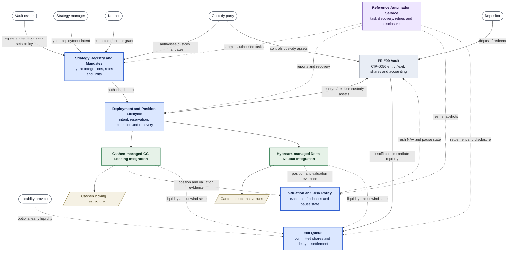

## Development Fund Proposal

**Organization:** Namas Labs Private Ltd (HyprEarn) \
**Author / Primary Contact:** Abhay ([github.com/abhayait](https://github.com/abhayait)), Rohit ([github.com/web3cook](https://github.com/web3cook)) \
**Status:** Submitted \
**Created:** 2026-09-16 \
**Updated:** 2026-09-17 \
**Proposal Type:** RFP-aligned \
**RFP / Roadmap Area:** RFP 13, Payments and DeFi, under Financial Markets, Standards & Verification ([2026-2028 roadmap](https://github.com/canton-foundation/canton-dev-fund/blob/main/2026-2028-strategic-roadmap.md))

**Champion:** Luke Farrell, Cashen (@cashenLuke) \
**Total Funding Request:** 3,000,000 CC \
**Project Duration:** 3 to 5 months build, plus 6 months adoption window \
**Label:** defi-liquidity

---

## Abstract

Every Canton application that pools capital and puts it to work faces the same four problems: who may deploy that capital and within what limits, how a deployment and the resulting position are controlled through their lifecycle, where the share price comes from and what stops it moving wrongly, and what happens when depositors want out faster than the capital can unwind. Tokenized vaults, curated lending markets, Canton Coin locking pools, treasury products and agent-managed portfolios each need all four. Today each team rebuilds them privately, or ships without them. This proposal delivers those four controls as open, reusable yield infrastructure that any Canton application can adopt.

The Canton ecosystem is converging on a tokenized vault standard: the ERC-4626-equivalent interface proposed in [PR #99](https://github.com/canton-foundation/canton-dev-fund/pull/99). That standard is necessary and we build on it directly rather than propose an alternative.

It is not, on its own, sufficient. A vault interface answers *what a depositor may ask for*. It does not answer the three questions that determine whether depositor funds are actually safe: 
1. **where the share price comes from and what stops it moving wrongly**
2. **what the party managing the capital is permitted to do with it**
3. **what happens when redemption demand exceeds what the vault can liquidate today**. 

On Canton these are not theoretical concerns. Maintaining Featured App status under CIP-0116 requires a continuously active Canton Coin lock. Initiating an unlock causes the application to lose Featured status, after which the released CC becomes withdrawable gradually at 1/60 per day over 60 days. A vault backed by this position therefore cannot guarantee immediate redemption from the locked capital without maintaining a liquid buffer or sourcing liquidity from a third party.

This proposal funds the open-source **strategy-control and safety extension** that sits around the vault standard: a registry and typed mandate system for approved strategies, a controlled deployment and position lifecycle, a valuation and risk-policy layer, and an orderly exit queue for positions that cannot unwind on demand. Restricted automation is expressed through narrowly scoped operator mandates rather than a separate source of authority. All four Daml components and their supporting reference automation service ship MIT-licensed so that any vault built to the ecosystem standard can adopt and operate the layer.

To validate the layer end-to-end, we integrate two strategies operated and maintained by their respective teams: a **Cashen CC-Locking Strategy** and a **Hyprearn Delta-Neutral Funding-Rate Strategy**. The concrete strategy implementations and their Strategy Integration Modules are not MIT-licensed deliverables under this grant; each team retains ownership and determines its licensing and disclosure policy. The grant-funded extension remains strategy-agnostic and MIT-licensed.

---

## Response to RFP 13: Payments and DeFi

This proposal responds to RFP 13 under Financial Markets, Standards & Verification. The RFP asks for open-source tooling, reference implementations and standards for payments, DeFi, settlement and liquidity workflows that support real economic activity, improve composability, and serve multiple Canton applications rather than one.

| RFP 13 asks for | What this proposal delivers |
|---|---|
| Open-source tooling and reference implementations | MIT-licensed extension DARs (registry and mandates, deployment lifecycle, valuation and risk policy, exit queue), a reference automation service, and a conformance suite any team can run against its own vault |
| Standards | A CIP amendment to the PR #99 vault standard defining the valuation, pause, reservation and committed-share hooks, jointly specified with Mystic Finance |
| Settlement and liquidity workflows | CIP-0056 allocation-based entry and exit, an orderly exit queue for positions that cannot unwind on demand, and an optional third-party early-liquidity path |
| Real economic activity | A MainNet vault with real capital, sourcing at least one Featured App's CIP-0116 locking requirement, with the share token tradeable on a Canton DEX (Milestone 3) |
| Reusable across multiple applications | Six independently operated vaults by teams other than Hyprearn and at least one third-party Strategy Integration Module (Milestone 4); see §Partners and Users for how each partner adopts the layer |

The specific problem: pooled-capital applications on Canton have no shared way to bound delegated authority, evidence external positions, guard share price, or exit illiquid positions. The user need: teams launching vaults, curated markets or locking pools need these controls audited once and reused, not rebuilt per team. The evidence: the partners and protocols in §Partners and Users, and the CIP-0116 locking obligation described in §Motivation.

---

## Specification

### 1. Objective

Deliver a production-ready, audited, MIT-licensed set of Daml contracts and supporting reference automation that extends the tokenized vault standard in PR #99 with reusable controls for strategy operation, comprising:

1. **Strategy Registry and Mandates:** approved, typed Strategy Integration Modules and revocable grants defining what each manager or automated operator may do.
2. **Deployment and Position Lifecycle:** controlled reservation and deployment of vault assets, with separate atomic-Canton and externally-settled execution paths.
3. **Valuation and Risk Policy:** evidence-backed strategy valuation contributions, freshness controls, share-price inputs and fail-safe pause behavior.
4. **Redemption and Early-Liquidity Queue:** delayed exit handling with committed shares, normal vault settlement and an optional third-party liquidity path.

Plus, to demonstrate and validate the layer:

5. **Two team-managed strategy integrations:** integration of a Cashen-managed CC-locking strategy and a Hyprearn-managed delta-neutral funding-rate strategy to validate the extension under real conditions. The concrete Strategy Integration Modules remain owned, operated and licensed by their respective teams. The MIT-licensed conformance suite can be run by any team against its own integration or vault.

This is a single objective: the strategy-control and safety extension for standard-conformant vaults, validated against two team-managed strategy integrations under real conditions. It is explicitly **not** a proposal to fund Hyprearn's operated vault business; the operated deployment exists to demonstrate the framework and to satisfy the Fund's preference for adoption evidence over artifacts.

### 2. Implementation Mechanics

This deliverable is strictly an extension of the tokenized vault standard in PR #99. PR #99 remains responsible for deposits, mints, withdrawals, redemptions, share accounting and CIP-0056 share issuance. The blue components below are the Daml extension funded by this grant; the purple node is its supporting off-ledger reference automation; the grey vault is adopted from PR #99; the green nodes are team-managed Strategy Integration Modules outside the MIT-licensed deliverable; and the tan nodes are systems whose strategy mechanics are not part of the base layer.

The vault owner and custody party are separately configurable Daml parties and may be assigned to the same party in a self-custodied deployment. The vault owner configures vault policy and registers permitted strategies. The custody party controls the vault assets and authorises custody-affecting mandates and transfers. A strategy manager or keeper may act only through a live, strategy-scoped grant that remains within the owner-approved policy and, where assets may move, has been authorised by the custody party. Automation receives neither the custody party's signing credentials nor general transfer authority. Compromise or misuse of the custody party remains an explicit trust assumption unless the deployment uses threshold or decentralised custody.

#### 2.0 What we adopt rather than build

Share accounting, deposit/redeem entry points, and CIP-0056 share-token issuance are **taken from the ecosystem tokenized vault standard** (PR #99) once it lands. We do not ship a competing production vault implementation. We implement extension contracts against that interface and work with Mystic Finance on the hooks required to consume a fresh valuation and pause state, reserve assets for deployment, commit shares to a queued exit, and report strategy-aware values from `Vault_MaxWithdraw` and `Vault_MaxRedeem`. Where the standard does not yet expose a required hook, we raise it as an amendment rather than fork the interface.

Entry and exit are designed around the token standard's Allocation Request and Allocation workflows rather than a Hyprearn-specific wallet choice. For a deposit, the vault publishes an `AllocationRequest` for the depositor's configured base asset (the PR #99 underlying asset); a wallet supporting the Allocation Request API creates the corresponding `Allocation`, which the PR #99 vault settles atomically against newly issued shares. For redemption, the holder allocates vault shares and the vault settles them against that base asset. PR #99 currently exposes `Vault_Deposit` and `Vault_Redeem` as vault-specific choices and assumes each deployer publishes its own API; making those reachable through the allocation flow is the first amendment we raise.

This design allows compatible wallets and custodians to reuse their CIP-0056 allocation workflow, but compatibility depends on PR #99 exposing the necessary settlement hooks. Milestone 1 verifies deposit and redemption end-to-end using the unmodified [Splice Portfolio example](https://github.com/canton-network/wallet/tree/main/examples/portfolio) and its Wallet Gateway: CIP-0056 Allocation Request and Allocation workflows are used for asset movement, while wallet connection and signing use the CIP-0103 dApp API. Normal runtime configuration is permitted, but the Portfolio application code is not modified for the vault.

Standard deposit, mint, withdraw and redeem do not require any Hyprearn role-specific package. The optional delayed-exit workflow requires only the lightweight wallet and common API packages and their generated TypeScript bindings; it does not depend on management, operator, liquidity-provider, core or strategy-specific packages.

*Dependency note:* the vault CIP and its reference implementation are scheduled inside PR #99's Milestone 2. Our Milestone 1 is specified against the published interface and can be developed in parallel against a minimal test implementation, then connected to the canonical implementation. That test fixture is not a production alternative to PR #99. The schedule dependency is real and is addressed in §Rationale.

#### 2.1 Strategy Registry and Mandates

The vault owner registers each permitted strategy through a typed **Strategy Integration Module** and a common policy record. A Strategy Integration Module is the strategy-specific Daml implementation that connects the generic lifecycle to a protocol or venue. The registration identifies permitted assets and destination parties, per-action and aggregate allocation caps, minimum liquid reserves, valuation freshness requirements, whether execution is atomic or externally settled, and the integration's emergency-unwind path. All strategy- and vendor-specific details remain within the team-managed Strategy Integration Module. The reusable registry does not hard-code any vendor-specific strategy details.

A manager receives a revocable and expiring mandate for one registered strategy integration. Every action must satisfy both the strategy registration and the manager's mandate. A mandate may impose stricter limits than the registration, but it cannot authorise an asset, destination, action or exposure that the registration does not permit. Automated keepers use the same mechanism through a more restricted operator grant, for example permission to execute an already-authorised rebalance within configured frequency, base-asset amount and strategy-specific limits. An exit-only grant may reduce exposure but cannot create new exposure.

This is expressed through Daml's static type system rather than a generic list of choice names or opaque payload filters. Each Strategy Integration Module implements the common strategy integration interface, exposes typed deployment, reporting and unwind choices, and enforces its own additional invariants. A delegated actor exercises only those choices permitted by the owner-approved strategy registration and its live mandate. Any mandate that can move or reserve assets must also be authorised by the custody party. The custody authorisation may narrow the strategy registration's limits but cannot widen them.

#### 2.2 Deployment and Position Lifecycle

A strategy manager begins by creating a typed **Deployment Intent**. It identifies the strategy registration, asset, amount, direct destination, action type and validity window. Before any asset is released, the contracts verify that the strategy and mandate are active, the asset and destination are permitted, per-action and aggregate limits remain satisfied, sufficient unreserved liquidity remains, and the minimum liquid reserve is preserved.

Execution then follows one of two paths declared by the strategy integration:

- **Atomic Canton execution:** where the destination protocol exposes compatible Daml choices, the intent, CIP-0056 movement and resulting position evidence settle in one transaction.
- **External execution:** where a venue is outside that atomic path, the authorised amount is first reserved on-ledger. Reserved assets remain part of NAV but are excluded from liquid value and cannot fund another deployment or redemption. Under a live custody authorisation referencing the approved deployment intent, the custody party then transfers the assets directly to the allowlisted venue or account; no manager or intermediate operator takes custody or receives the custody party's signing credentials. A conventional external venue may additionally require an issuer withdrawal, bridge, custodian or venue API operation that Daml can authorise and record but cannot execute atomically or prove without subsequent evidence.

Once the custody party records that the assets have been submitted to the external destination, the position enters `ExternalPending`. A pending amount is not treated as a confirmed strategy position and does not receive operator-reported profit or yield. Valuation-dependent deposit, mint, withdraw, redeem and queue-settlement execution remains paused until a fresh, correctly sequenced position report confirms the credited position and its base-asset value. Confirmation atomically replaces the pending amount with an active valuation component. Expiry, failure or inconsistent evidence moves the deployment to `RecoveryRequired`; it does not silently restore liquidity or accept a manager-supplied value.

Every active position reports both its current value and liquidity state through its strategy integration. Unwind follows the same distinction: an on-ledger position may unwind atomically, while an external position moves through requested, pending and evidenced settlement states. A separate exit-only mandate allows recovery without permitting new deployment.

#### 2.3 Valuation and Risk Policy

All common-layer accounting and valuation contributions are denominated directly in the vault's configured base asset. The extension does not perform generic cross-asset conversion and does not require a price oracle to aggregate NAV. Each registered strategy integration contributes a typed valuation component containing gross assets, liabilities, net value, liquid value, evidence references, an observation time and a monotonically increasing report sequence. The common valuation contract does not hard-code any vendor-specific accounting or valuation details. Each team-managed Strategy Integration Module determines its strategy value and submits the resulting base-asset-denominated valuation component through the common interface.

Canton contracts cannot scan global ledger state. For ledger-verifiable positions, the submitting automation identifies the relevant contracts and the valuation transaction fetches them, using disclosed contracts where required by Canton's privacy model. For external positions, the Strategy Integration submits base-asset-denominated balances, liabilities and net value through a configured position reporter, which may be the strategy operator or a separate party. Authentication establishes the report's provenance, not its economic correctness. Sequence, freshness, evidence and deviation policies limit stale, replayed or abnormal reports, while each deployment explicitly states what external evidence it requires and what trust remains. The accepted components are aggregated into a valuation snapshot consumed by PR #99's conversion and limit methods.

Where a Strategy Integration introduces a market-price-dependent on-ledger constraint, it must fetch an independent on-ledger price-reference contract in the same Daml transaction. A numeric price supplied by the manager, operator or position reporter cannot serve as that independent reference. Strategy Integrations whose values and limits are expressed directly in the vault's base asset do not require such a price feed.

The Valuation and Risk Policy constrains updates structurally:

- **Cadence and freshness:** an update submitted before its configured minimum interval is rejected without changing state. A snapshot also has a maximum age, after which valuation-dependent entry and exit execution is unavailable until an authorised update is accepted.
- **Source-aware reconciliation:** deposits, withdrawals, deployments, returns, fees and other strategy events are reconciled against their referenced evidence. Discrete strategy income can legitimately create a large step in NAV; a fully evidenced change is not treated as manipulation merely because it exceeds a percentage change from the prior snapshot.
- **Deviation bounds:** limits apply to unexplained residual changes and to riskier externally reported components, not blindly to the change in total NAV. An update that omits an active position, repeats a report sequence or double-counts an already recognised cash flow is refused.
- **Pause semantics:** a well-formed update with sufficient authority but an unexplained change outside policy commits a successor state marked `Paused`, preserving the last accepted valuation. A malformed or unauthorised command aborts without changing state. Recovery is a distinct, explicitly authorised choice.
- **Fee accrual:** platform and performance fees accrue against a high-water mark so a vault cannot charge performance fees on recovery from a drawdown.
- **Precision and rounding:** CIP-0056 asset and share quantities use Daml `Decimal` (`Numeric 10`). Conversion calculations may use a higher-precision intermediate `Numeric` type, but final token amounts follow explicit operation-specific rules: deposits round shares issued down, mints round assets required up, withdrawals round shares burned up, and redemptions round assets returned down. Preview and execution methods use identical arithmetic and rounding rules, and operations that would produce a zero asset or share amount are rejected. Fees denominated in assets or shares are rounded down at the final token boundary so that a depositor is never charged more than the mathematically calculated fee.

The submitting party, accepted component values, evidence references and resulting snapshot are auditable on-ledger by the parties entitled to see them; they are not presumed to be globally visible.

#### 2.4 Redemption and Early-Liquidity Queue

Where the vault's liquid balance covers an exit, it settles through PR #99's standard interface. Where it does not, the depositor can create a queued exit through the integration path agreed with Mystic Finance:

- A queued exit commits a fixed number of vault shares. Until settlement, those shares remain economically exposed to vault gains and losses but cannot be transferred, redeemed or committed elsewhere.
- The request specifies a minimum acceptable payout in the vault's configured base asset, an eligibility time and a deadline. The enforceable term is the minimum base-asset amount, not a percentage discount or an off-ledger quote.
- Settlement uses a fresh PR #99 conversion at the time of settlement. The request settles only if the resulting payout is at least the depositor's minimum. If NAV falls below that minimum, the request remains pending until its deadline unless the depositor cancels it while cancellation remains permitted.
- Strategy integrations report liquid value and unwind state to the queue. Vault-funded settlements process eligible requests in deterministic vault-assigned creation-sequence order, so a later request cannot be preferred over an earlier satisfiable request.
- The initial implementation settles requests in full and does not support partial fills. An unmatched request may be cancelled or may expire at its deadline, releasing the committed shares. Once assets have been reserved for that request or a third-party settlement has begun, it cannot be cancelled.
- The queue exposes an optional third-party early-liquidity hook. An eligible provider supplies at least the depositor's minimum base-asset payout and receives or redeems the committed shares through the deployment-specific implementation. Any difference between the fresh settlement value and the accepted payout is the economic premium. The base layer does not prescribe an auction, bilateral facility or solver market, and the mechanics and participant eligibility restrictions remain deployment-specific.
- Canton does not make a request globally visible. Any third-party path uses explicit disclosure to eligible parties, and implementations may disclose only the minimum information required to quote and settle.
- Queue settlement is unavailable while the required valuation is stale, the vault is paused or an external deployment is awaiting confirmation. Capacity limits, partial-state recovery and vault-wide pause behavior are explicit. The generic queue does not hard-code vendor-specific strategy details; each team-managed Strategy Integration Module supplies the required liquidity and unwind state through the common interface.

#### 2.5 Team-Managed Strategy Integrations

The extension is validated through integration with two independently managed strategies. Each strategy team owns, operates, maintains and licenses its concrete Strategy Integration Module. These modules consume the public extension interfaces but are not included in the MIT-licensed repository or delivered as open-source examples.

**Cashen-managed CC-Locking Strategy Integration.** Cashen builds, owns and operates the CC-locking mechanism and its concrete integration. The grant-funded extension exposes the common interfaces against which that integration is connected and tested. The intended result is that pooled vault capital can support a partner application's Featured App locking requirement without giving that application custody of principal, while depositors receive the agreed economic return. The exact treatment of locked principal, fees and any Featured App reward entitlement is determined by the team-managed integration and is not assumed by the base layer. The integration must preserve the relevant protocol and CIP-0116 invariants, including the loss of Featured status when an unlock is initiated and the gradual 1/60-per-day release over 60 days.

**Hyprearn-managed Delta-Neutral Funding-Rate Strategy Integration.** Hyprearn owns, operates and licenses this strategy and its concrete integration. The integration uses the public extension interfaces for pooled control: typed deployment intents, allowlisted direct transfers from the custody party to venues or accounts, position reports, allocation and leverage limits, rebalancing controls, reconciliation and emergency unwind. A venue may expose Canton-native position contracts or may sit outside Canton; the integration supports both evidence paths without representing an external position as if Daml could observe it directly. It also records whether the long and short legs reference the identical instrument or merely correlated instruments.

#### 2.6 Role-specific packaging

The extension is published as separately versioned Daml interface and implementation packages rather than one monolithic DAR:

- `vault-extension-common-api` contains stable identifiers, shared records, views and common interfaces, with no concrete strategy dependency.
- `vault-extension-wallet-api` exposes only the choices and views required to create, inspect and cancel a queued exit. Standard PR #99 entry and exit do not depend on it.
- `vault-extension-manager-api` exposes strategy-registration views and typed deployment-intent and unwind interfaces.
- `vault-extension-operator-api` exposes restricted execution and reporting interfaces, without governance or strategy-registration choices.
- `vault-extension-liquidity-api` exposes the selectively disclosed request, quote and settlement interfaces required by an optional early-liquidity implementation.
- `vault-extension-core` contains the concrete registry, mandate, deployment, valuation and queue implementations used by the vault operator and custody party.
- Concrete Strategy Integration Modules are independently packaged, deployed and licensed by their respective strategy teams. They implement the public integration interfaces but are not bundled into the MIT-licensed extension core.

Each role-specific API depends only on the common API and the standards it consumes; it does not depend on `vault-extension-core` or a concrete Strategy Integration Module. We publish generated TypeScript bindings for the common, wallet, manager, operator and liquidity-provider APIs alongside their DARs. Package boundaries reduce integration, code-generation, vetting and upgrade coordination requirements; they are not an authorisation mechanism. Parties receive authority only through Daml controllers, signatories and live mandates.

#### 2.7 Time bounds on Canton

Canton ledger time is not exact; a transaction's ledger time can differ from wall clock time by several minutes. Every time bound in this layer (the valuation update delay, mandate expiry, queue maturity and deadline, operator frequency limits) is therefore specified with an explicit tolerance window rather than a point in time, and no window is set shorter than the tolerance. Where the boundary is uncertain, the contract fails safe: a delay is enforced against the later bound, so fuzziness can never allow an extra update, and an expiry is enforced against the earlier bound, so an expired mandate can never be used.

#### 2.8 Reference Automation and Integration Service

Daml contracts do not execute autonomously. The grant therefore includes an MIT-licensed TypeScript reference service that demonstrates how an operator runs the extension safely through the Ledger API and PQS. It:

- discovers pending deployment, valuation, recovery and queue tasks;
- submits commands with bounded retries, command deduplication and idempotent task handling;
- submits authenticated position and valuation reports supplied by the configured reporters for Strategy Integrations;
- advances vault-funded queued exits when sufficient liquid assets are available;
- serves disclosed contracts through an authenticated off-ledger endpoint to eligible early-liquidity providers without making requests globally visible; and
- resumes processing from ledger state following restart or failure.

The service receives only the reporter, keeper or queue authority required for its tasks. It does not hold custody authority, select strategies, calculate external positions as authoritative truth or make discretionary investment decisions. Production deployments remain responsible for operating, monitoring and securing their own instance.

### 3. Architectural Alignment

- **Extends rather than replaces.** The proposal consumes the ecosystem tokenized vault standard (PR #99) as its accounting layer and contributes conformance tests and a CIP amendment back to it. It introduces no competing share or vault interface.
- **CIP-0056 at the vault boundary.** Vault assets and shares use CIP-0056 for entry, exit and any Canton-native movement. An external venue position may use that venue's own representation; the strategy integration records and reconciles it without describing it as a CIP-0056 holding.
- **Team-managed integrations.** The common layer does not hard-code vendor-specific strategy details. Each team-managed Strategy Integration Module implements those details behind the same public registration, deployment, reporting and exit interfaces.
- **Configurable custody boundary.** The vault owner and custody party are separate configurable roles, although a deployment may assign both roles to the same Daml party. The vault owner governs strategy policy, while the custody party controls asset movement. Delegated managers and operators cannot take custody: external deployments transfer directly from the custody party to an allowlisted venue or account. A deployment may additionally use BitSafe's [Decentralization Manager](https://github.com/canton-foundation/canton-dev-fund/pull/298), following the integration path PR #99 describes for decentralised custody.
- **Priority areas.** Primary fit is **RFP 13, Payments and DeFi**: reusable open-source components and a standard amendment for liquidity and settlement workflows serving multiple applications. Secondary fit is **Security, Assurance & Incident Readiness** (RFP 22 secure Daml patterns; RFP 26 segregation of duties and multi-party approval, which the mandate and custody-party model delivers) and **App Building and Developer Experience** (teams launching vaults stop rebuilding valuation, authority and redemption logic). Given the framework handles depositor funds directly, we request **Security Subcommittee** review as part of the review process.

### 4. Backward Compatibility

The extension packages are new and opt-in, make no change to the Canton protocol, and do not alter vaults that do not adopt them. Any required PR #99 amendment follows PR #99's compatibility policy and is not assumed to be backward-compatible until jointly specified and accepted with Mystic Finance.

---

## Partners and Users

This layer is not being specified in isolation. Three partners work with us on the standard it builds on, the features it exposes and its route to adoption, and two protocols are already committed to building on top of it. Between them they cover both sides of the test that matters for shared infrastructure: something has to depend on the interface below us, and something has to be built on the interface above us.

These are working relationships agreed between the teams rather than executed contracts. The closest technical collaboration is with Mystic Finance and Cashen, with whom we will implement the architecture directly.

### Partners

**[Mystic Finance](https://mysticfinance.xyz/)** is the team behind [PR #99](https://github.com/canton-foundation/canton-dev-fund/pull/99), the curated lending and tokenized vault standard, and operates curated vaults in which third-party curators allocate single-asset deposits across isolated markets under predefined risk parameters.

*How we collaborate:* the deliverable is strictly an extension of their standard rather than a competing vault. Share accounting, deposit and redeem entry points and CIP-0056 share-token issuance remain in PR #99. With Mystic we define the hooks through which the vault consumes a fresh valuation and pause state, reserves assets for an authorised deployment, commits shares to a queued exit and answers `Vault_MaxWithdraw` and `Vault_MaxRedeem` when strategies have non-zero unwind time. We contribute conformance tests and raise any missing hook as an amendment rather than fork the interface. We expect to be the standard's first named external consumer.

**[Noves](https://noves.fi/)** is a digital-asset data platform that classifies and reconciles on-chain and private transaction data into audit-ready form for institutions, with coverage across more than 120 chains including Canton.

*How we collaborate:* data partner on Canton and a route to ecosystem adoption. Noves already supports Canton and indexes chain data as part of its general coverage, which is the precondition for what we want from the partnership: every valuation submission, mandate exercise and queue settlement in this layer is recorded on-ledger by construction, and turning that record into position, performance and reconciliation reporting is what makes a vault built on this layer legible to institutional depositors. The layer produces the auditable history; the data partnership is what makes it consumable.

**[Avicenne Studio](https://www.avicenne.studio/)** is a Web3 development studio based in Paris and Dubai that takes products from specification and design through full-stack delivery, with prior work including Usual and Linea Hub.

*How we collaborate:* partner on feature finalisation and ecosystem adoption. They work with us on specifying the extension interfaces and on the integration path other teams follow when adopting a single component, which is the deliverable Milestone 1 is judged on and the precondition for the third-party adoption Milestone 4 requires.

### Protocols building on the layer

**[Cashen](https://www.cashen.cc/)** is an institutional marketplace on Canton for CC locking, matching Featured Apps and Super Validators with Canton Coin suppliers who earn a fixed yield while retaining custody and taking no principal credit risk.

*How we integrate:* Cashen builds, owns, operates and licenses the CC-locking mechanism and its concrete Strategy Integration Module. The module maps position, liquidity, valuation and unwind evidence into the public extension interfaces and is connected and tested against the grant-funded layer without becoming an open-source grant deliverable. The proposal states the intended pooled-capital and depositor-return outcome without pre-empting the accounting or protocol rules implemented and maintained by Cashen.

**[Tempora Labs](https://temporalabs.com/)** builds autonomous agentic infrastructure for portfolio management, where agents rebalance and manage allocations from natural-language intents within user-defined risk parameters, with an audit trail behind every action.

*How we integrate:* Tempora enables agentic management of vaults built on this layer. An autonomous agent receives a narrow operator grant under the same mandate model as a human manager, with lower allocation, frequency and economic limits and no custody of vault assets. What the agent may do is bounded by typed contracts rather than by the agent's own judgement or the correctness of its prompt.

**[Canborsa](https://app.canborsa.com/)** is the first perpetual DEX native to Canton: a non-custodial venue for perpetual contracts on crypto, including Canton Coin, and on tokenized real-world assets such as equities, commodities and indices, with Canton Coin usable directly as margin collateral.

*How we integrate:* Hyprearn owns, operates, maintains and licenses the delta-neutral funding-rate strategy and its concrete Strategy Integration Module, and works with Canborsa to run the strategy against its markets. The module constrains permitted markets, instruments, directions, leverage and notional and records whether the long and short legs reference the identical instrument or merely correlated instruments. When a venue exposes position contracts on Canton, the integration uses those contracts as evidence; when a venue or account is external, assets move directly from the custody party to an allowlisted destination and the resulting position is confirmed through authenticated reports. The open-source Daml deliverable is the common control, reporting and recovery layer, not the concrete strategy module or a claim that external execution occurs on-ledger.

### Hyprearn's current operations

Hyprearn (a product of dapplooker) currently has 4,000+ signed-up users and approximately USD 1 million in deposits in its delta-neutral vaults across multiple perpetual DEXes ([live vaults](https://app.hyprearn.com/delta-neutral-vaults)).

---

## Milestones and Deliverables

### Milestone 0: Proposal acceptance and mobilisation
- **Estimated Delivery:** On execution of the grant agreement
- **Focus:** Mobilisation. This milestone releases the initial tranche to secure the audit engagement with QuillAudits and other auditors and to begin integration work with Mystic Finance and Cashen, so that Milestone 1 starts with the audit slot and partner interfaces committed.
- **Deliverables / Value Metrics:** Grant agreement executed; audit engagement letter signed with QuillAudits; integration kick-off with Mystic Finance and Cashen confirmed on the PR.

### Milestone 1: Safety layer core
- **Estimated Delivery:** 1.5 months from approval
- **Focus:** Published design specification and threat model for the PR #99 extension, covering the separation between vault ownership, vault operation and asset custody, including deployments where the vault owner and custody party are different Daml parties; delegated manager and keeper authority; asset deployment; external-position evidence; valuation manipulation; and redemption stress. Strategy Registry and Mandates; Deployment and Position Lifecycle; Valuation and Risk Policy; Redemption and Early-Liquidity Queue. Conformance tests cover both atomic Canton strategy integrations and externally settled strategy integrations. A reference automation service demonstrates safe operation of the passive Daml workflows.
- **Deliverables / Value Metrics:** All four extension components running on DevNet against PR #99's interface or, until its canonical implementation is available, a minimal test fixture implementing that interface; separately versioned common, wallet, manager, operator and liquidity-provider API DARs; a core implementation DAR; generated TypeScript bindings for every role-specific API; an MIT-licensed TypeScript reference automation service with PQS and Ledger API task discovery, retry, deduplication, restart recovery and selective-disclosure examples; public strategy-integration interfaces and conformance tests; an end-to-end deposit and redemption demonstration using the unmodified Splice Portfolio example through its CIP-0056 allocation workflows and CIP-0103 wallet connection, with only normal runtime configuration; MIT-licensed repository published; integration guide published, including a minimal synthetic test integration that builds and runs from a clean checkout without containing either team's strategy logic.

### Milestone 2: Team-managed strategy integrations and audit
- **Estimated Delivery:** 1 to 2 months from Milestone 1, on close of the audit engagement
- **Focus:** Integration of the Cashen-managed CC-locking strategy and the Hyprearn-managed delta-neutral strategy with the extension layer; third-party security review of the extension and its integration boundaries, with remediation.
- **Deliverables / Value Metrics:** Both team-managed strategy integrations operating on TestNet under a PR #99 vault; the strategy implementations and their concrete Strategy Integration Modules remain privately managed and are not open-source milestone deliverables; delta-neutral external deployments move directly from the custody party to an allowlisted venue or account and complete through authenticated position evidence; audit report and remediation published. The required valuation, pause, asset-reservation and committed-share hooks are jointly specified with Mystic Finance and incorporated into the canonical PR #99 interface and reference implementation, or into a versioned extension interface jointly published and recognised by Mystic Finance as the canonical integration path. Both integrations are demonstrated against that canonical implementation. Submission of an amendment without acceptance or implementation does not satisfy this milestone, and no production fork of PR #99 is delivered.
- **Auditors:** [QuillAudits](https://www.quillaudits.com/) engaged; additional quotes in progress

### Milestone 3: MainNet reference deployment
- **Estimated Delivery:** 1 to 2 months from Milestone 2, on partner onboarding
- **Focus:** Reference PR #99 vault live on MainNet using the Cashen Strategy Integration, demonstrating the lifecycle from authorised deployment through valuation and an exit against a position with non-zero unwind time.
- **Deliverables / Value Metrics:** Vault live with real capital; **at least one partner application's Featured App locking requirement sourced through the pooled vault**; **at least one vault-related asset (the vault share token) tradeable on a Canton DEX**; public dashboard of vault state, valuation history and pause events.

### Milestone 4: Ecosystem adoption
- **Estimated Delivery:** 6 months from Milestone 3
- **Focus:** Onboarding other teams onto the framework; Strategy Integration Module authoring documentation and support; contributing components upstream where the ecosystem standard is the better home.
- **Deliverables / Value Metrics:** **6 independently-operated vaults, run by teams other than Hyprearn, using at least one component of this layer**, and **at least one Strategy Integration Module authored by a third party** against the extension interfaces. Cashen and Tempora Labs are committed candidates for the first two; the remaining four are to be sourced from teams building on the PR #99 standard and from Featured Apps with CIP-0116 locking obligations. Payment for this milestone is per verified adopting team, so an unfilled slot costs the Fund nothing.

---

## Acceptance Criteria

Evaluated by the Tech & Ops Committee on:

- **Milestone 0:**
  - Grant agreement executed.
  - Audit engagement letter signed with QuillAudits.
  - Integration kick-off with Mystic Finance and Cashen confirmed on the PR.
- **Milestone 1:**
  - Published design specification and threat model.
  - Demonstrable operation of all four extension components on DevNet, including:
    - An unregistered strategy or disallowed direct destination being refused.
    - A vault operating with the vault owner and custody party assigned to different Daml parties.
    - A strategy registration without the corresponding custody authorisation being unable to reserve or transfer assets.
    - A custody authorisation being unable to permit an asset, destination, action or exposure outside the owner-approved strategy registration.
    - An operator grant enforcing limits narrower than its manager's mandate.
    - An exit-only grant permitting unwind but refusing new exposure.
    - Reserved assets being excluded from liquid value.
    - An external deployment pausing valuation-dependent entry, exit and queue settlement until a fresh, correctly sequenced position report atomically replaces it with an active valuation component.
    - An expired or inconsistent pending deployment entering `RecoveryRequired`.
    - A replayed or stale report being refused.
    - A large valuation change backed by recognised strategy evidence being accepted while an equivalent unexplained change commits a paused successor state.
    - A queued exit committing its shares so they cannot be transferred, redeemed or queued twice.
    - Settlement at a fresh conversion meeting the depositor's minimum.
    - Deterministic vault-funded queue ordering and cancellation boundaries.
    - A standard vault settlement and an optional third-party early-liquidity hook.
    - A time-bounded action at the edge of its window correctly refusing under ledger-time tolerance.
    - A depositor entering and exiting through CIP-0056 Allocation Request and Allocation workflows using the unmodified Splice Portfolio example, connected to its Wallet Gateway through the CIP-0103 dApp API. The demonstration may change runtime configuration but must not require changes to the Portfolio application code.
    - Conversion tests covering deposit, mint, withdraw and redeem, including minimum-unit and dust cases, with previews exactly matching execution rounding.
    - Package-dependency tests proving that standard CIP-0056 entry and exit require no extension-specific package, a queue-aware wallet depends only on the wallet and common APIs, and no role-specific API depends on the core implementation or a concrete Strategy Integration Module.
  - The reference automation must recover after restart without duplicating a deployment or report, retry a contended submission from current ledger state, and refuse to operate without the required live reporter, keeper or queue mandate.
  - Manager and keeper automation must operate without access to the custody party's signing credentials or unrestricted transfer authority.
  - Published MIT repository, separately versioned API and implementation DARs, generated TypeScript bindings for every role-specific API, the reference automation service, and a minimal synthetic test integration that builds and runs from a clean checkout without containing either team's strategy logic.
- **Milestone 2:**
  - Both team-managed strategy integrations operating on TestNet under typed mandates; publication of their source code is not an acceptance requirement.
  - Cashen Strategy Integration behavior agreed with Cashen and connected to its locking infrastructure.
  - Delta-neutral direct deployment, authenticated reporting, hedge-composition disclosure and recovery flow demonstrated.
  - Completed audit with published report and remediation.
  - Required integration hooks jointly accepted with Mystic Finance and demonstrably operating against the canonical PR #99 reference implementation or a jointly recognised canonical extension interface.
  - Any corresponding specification amendment submitted.
  - No production fork maintained.
- **Milestone 3:**
  - MainNet PR #99 vault live with the Cashen Strategy Integration.
  - At least one partner application's Featured App locking requirement sourced through the vault.
  - At least one vault-related asset tradeable on a Canton DEX.
  - At least one queued exit against a long-unwind position settled end-to-end.
- **Milestone 4:**
  - 6 independently-operated vaults live using the layer.
  - At least one third-party-authored Strategy Integration Module.
  - Adoption by other teams, not delivery of our own artifacts, is the criterion.

---

## Funding

**Total Funding Request:** **3,000,000 CC**

### Payment Breakdown by Milestone
- Milestone 0 (Proposal acceptance and mobilisation): **300,000 CC** upon grant agreement execution, covering the audit engagement deposit with QuillAudits and partner integration kick-off
- Milestone 1 (Safety layer core): **600,000 CC** upon committee acceptance
- Milestone 2 (Reference strategies and audit): **600,000 CC** upon committee acceptance
- Milestone 3 (MainNet reference deployment): **600,000 CC** upon committee acceptance
- Milestone 4 (Ecosystem adoption): **900,000 CC** 150,000 for each vault deployment for different teams, capped at 6 teams.

Adoption-directed work (Milestone 4 in full, plus the integration-support and documentation components of Milestones 1 and 3) accounts for approximately **35–40%** of the total, per committee guidance that 30–50% should drive ecosystem adoption.

### Volatility Stipulation

The project duration exceeds 6 months. The grant is denominated in fixed Canton Coin and will require a re-evaluation at the 6-month mark, per Development Fund policy.

---

## Maintenance & Ownership

Two distinct artifacts:

- **The extension layer** (Strategy Registry and Mandates, Deployment and Position Lifecycle, Valuation and Risk Policy, Redemption and Early-Liquidity Queue, role-specific API DARs and TypeScript bindings, reference automation service, and conformance suite) is published by Namas Labs Private Ltd under the **MIT license** as a public good. Namas Labs Private Ltd commits to maintaining it for a minimum of **12 months** following Milestone 2 acceptance (bug fixes, dependency updates, and compatibility with changes to the tokenized vault standard and CIP-0056), funded from protocol operations, with no further grant requested for maintenance.
- **Team-managed strategies** (including their concrete Strategy Integration Modules, strategy parameterisation, allocation policy and operational tooling) remain owned, operated, maintained and licensed by their respective teams. The strategy integration interfaces, conformance suite and synthetic test integration are MIT-licensed; the two concrete strategy integrations are not open-source grant deliverables.

All reusable extension-layer code authored under this grant is released under MIT. Concrete strategy implementations and team-managed Strategy Integration Modules are outside the open-source deliverable and retain the licenses selected by their respective owners. The deliverables do not copy, modify, import or bundle the AGPL-3.0 `canton-token-template`. Official CIP-0056 interface DARs and `splice-test-token-v2` may be used under Apache-2.0 and retain their original license and notices; test fixtures and third-party DARs are not represented as MIT-authored code. Cashen's locking infrastructure remains a separately licensed external dependency. Distributed third-party artifacts and their licenses are recorded in `THIRD_PARTY_NOTICES`.

1. **Canton:** 3.5.x release line
2. **Canton protocol:** version 35
3. **Daml-LF:** 2.3
4. **Exact SDK patch:** pinned per tagged release to the version recommended for the target network
5. **Upgrade compatibility:** non-breaking releases must pass Daml SCU checks against the preceding public DAR; breaking changes use a new major package with an explicit migration path

---

## Co-Marketing

Each partner named in §Partners and Users has agreed to support co-marketing of this work. Upon each milestone release, Namas Labs Private Ltd will collaborate with the Foundation, and with those partners where relevant, on:
- Joint announcement of each component release
- A technical deep-dive on safe vault design for Canton, covering valuation manipulation resistance, bounded manager authority, and redemption under long unwind periods
- Developer-facing material on implementing a typed Strategy Integration Module against the extension interfaces
- Upon MainNet launch, business development toward Featured App operators with CIP-0116 locking obligations

---

## Motivation

The Foundation's 2026-2028 roadmap describes Canton as the venue where treasury management, financing and investing move on-chain, with DeFi protocols and on-chain intermediaries repackaging high-quality assets for consumers. Every one of those products pools capital and deploys it under delegated control. Canton is about to have a tokenized vault standard, and that will cause such products to be built. The standard defines the interface between a depositor and a vault. It does not define how strategies are approved, how delegated actors deploy custody assets, how external positions are reconciled, or how an exit proceeds when capital is not immediately liquid. Each of those is security-critical, subtle, and will be rebuilt inconsistently unless a shared layer exists.

Canton makes some of this easier and one part of it harder. Easier: Daml can express strategy-specific authority through typed choices and on-ledger grants rather than opaque payload filtering. Harder: Daml cannot inspect an external venue, Canton contract visibility is permissioned, and an important native capital use cannot be exited on demand.

Under CIP-0116, every Featured App must lock 5,000,000 CC against its PartyId (25,000,000 CC for asset issuers) and hold it continuously, and following CIP-0078 there are no app rewards at all for unfeatured applications. That is a large, mandatory, illiquid capital position facing every current and prospective Featured App simultaneously, with no provision for reuse of existing locks. Most teams affected cannot post that capital alone. Pooling is the natural structure: initiating an unlock sacrifices the application's Featured status, and the released capital then becomes withdrawable only at 1/60 per day over 60 days. A vault cannot therefore guarantee immediate redemption directly from the active locked position; it requires a liquid reserve, third-party liquidity, or an orderly delayed-redemption mechanism.

The Cashen integration is therefore a strong reference case for the extension: it tests custody-preserving deployment, strategy-specific invariants, non-zero unwind time, valuation evidence and queued exits without requiring this grant to rebuild Cashen's locking contracts.

**Portion of the ecosystem that benefits.** Every Featured App and asset issuer carries a CIP-0116 locking obligation and is a candidate user of a pooled locking vault. In the Development Fund queue alone, at least eight open proposals involve vaults, yield products or pooled strategies (including PR #99, #235, #144, #186, #44, #73, #85 and #672), each of which would otherwise implement its own delegation, valuation and exit logic. We expect the majority of vault-style applications launched on the PR #99 standard to adopt at least one component of this layer, and Milestone 4 is paid only against such adoption.

---

## Rationale

**Why build on the tokenized vault standard instead of a complete stack of our own.** Two proposals delivering competing vault interfaces would be a direct loss for the ecosystem. This deliverable is therefore strictly an extension of PR #99 and is developed with Mystic Finance. The cost is a schedule dependency on their Milestone 2. We mitigate it by specifying against the published interface and developing against a minimal test fixture, which is replaced by the canonical implementation rather than becoming a production fork. Milestone 2 is not accepted until the required hooks operate against the canonical PR #99 implementation or a versioned extension interface jointly recognised by Mystic Finance as canonical.

**Why the extension layer rather than more strategies.** More strategies are the commercially attractive path and are not a public good; any team can add one through a Strategy Integration Module. Typed delegation, controlled deployment, position evidence, valuation policy and delayed exits are shared, security-critical mechanisms. The Fund supports the reusable components, public integration interfaces and conformance tooling. Each strategy team owns and manages its concrete strategy implementation, while integration with the two strategies provides adoption and validation evidence.

**Why integrate a Cashen-managed strategy rather than build CC locking.** Cashen already provides and manages the domain-specific locking infrastructure and its concrete integration. Connecting it through the public interfaces exercises every part of the extension—custody-preserving deployment, strategy-specific invariants, valuation and liquidity evidence, and delayed exits—without duplicating or open-sourcing Cashen's contracts or Strategy Integration Module. The extension remains strategy-agnostic if tokenomics policy changes.

**Why this is a separate extension rather than folded into PR #99.** Following discussion with Mystic Finance, PR #99 remains the canonical vault standard and owns entry, exit, share accounting and issuance, while this proposal delivers the strategy-management, deployment, valuation and delayed-exit extension layer. We coordinate the integration boundary with Mystic Finance and contribute any required hooks, interface amendments and conformance tests to PR #99 rather than introducing a competing vault interface or maintaining a production fork.

**On prior art.** Strategy authorization, position accounting and queued exits are established vault patterns, and we make no claim to originating them. The contribution is a Daml-native extension of PR #99: typed Strategy Integration Modules instead of arbitrary-call filters, an explicit custody-party trust boundary, separate atomic and externally evidenced execution paths, and disclosure-aware workflows for Canton's privacy model.

**Relationship to other proposals in the queue.** PR #99 (Mystic Finance) is the vault standard this layer extends; we contribute hooks and conformance tests to it and ship no competing interface. PR #298 (BitSafe Decentralization Manager) is an optional custody path for the custody party role and is not a dependency. PR #627 (Vacuumlabs delegated automation) addresses general bounded automation for Canton applications; this proposal's mandates are strategy-typed and vault-scoped, carry custody-party co-authorisation, and are consumed by the deployment lifecycle and exit queue, which #627 does not address. The two are independent and a deployment may use both.
